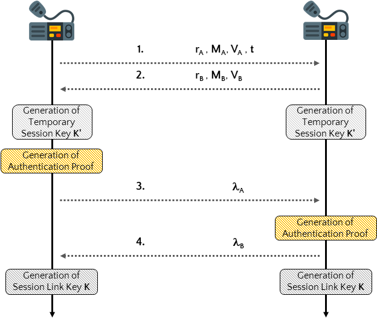

# SecureAIS - Securing Pairwise Vessels Communications (Proof of Concept)
SecureAIS is a key establishment protocol specifically designed to meet the features and bandwidth constraints of the Automatic Identification System (AIS) communication technology. It has been designed as a standard-compliant AIS application, that can be installed by Class-A and Class-B AIS transceivers to establish secure pairwise session keys with neighboring entities, being them either vessels or port authorities. SecureAIS integrates and concatenates well-known cryptographic blocks, such as the Elliptic Curve Qu-Vanstone implicit certification scheme and the Elliptic Curve Diffie Hellman key agreement algorithm, and its security has been formally verified using the automated tool ProVerif.

<p align="center">
     
</p>

A Proof of Concept using GNU-Radio and Ettus X310 SDRs on how to set up key exchange between two AIS transceivers for secure communication. It supports different security levels: none, <i>80, 128, 192,</i> and <i>256</i> bits.

<p align="center">
     
</p>

<i>For further details, please refer to the paper.</i>

# Why create this?
Nobody has done it in a way that is standard compliant or requires just a software update to make a security service work on AIS. In theory two friendly ships can implement all of this before leaving harbour and then communicate in secrecy.

# How to use
This project has two parts, a C++ program and a flowgraph in GNU-Radio. To set them up: </br>
1 - Install <i>gnuradio</i> software <br />
2 - Install <i>gr-aistx_with_input</i> block to gnuradio (instructions inside the block folder on how to compile and install it). If you are using PyBOMBS, please initialize your environment first. <br />
3 - Open <i>ais_transceiever.grc</i> flowgraph in GNU-Radio.  <br />
4 - Make sure ports <b>51999</b> and <b>5200</b> are not adopted by any network protocol. <br />
5 - Execute main or compile code from the source.<br />

<p align="center">
     
</p>

# How to compile code
To compile from source or use a different security level:
```
    g++ -O2 main.cpp -DSECURITY_LEVEL=1 ./secure_ais_protocol.cpp ./ais_receiver/*.c core-master/cpp/core.a -o main
```
## Security Level and other Flags
In order to set a different security level, you can add flag <i>-DSECURITY_LEVEL=<b>t</b></i> that ranges from 0 to 4.

<table>
  <tr>
    <th><b>Security Level (bits)</b></th>
    <th><i><b>t</b></i></th>
  </tr>
  <tr>
    <td>80</td>
    <td>1</td>
  </tr>
  <tr>
    <td>128</td>
    <td>2</td>
  </tr>
  <tr>
    <td>192</td>
    <td>3</td>
  </tr>
  <tr>
    <td>256</td>
    <td>4</td>
  </tr>
</table>

Other flags include: <br />
    -DPORT_SEND or -DPORT_RECEIVE to set another port for send/receive sockets <br />
    -DGEN_KEYS = true or false to set whether to generate keys or not <br />
Using gcc compile command would be: <br />


# Contributing
Pull requests are welcome. For major changes, please open an issue first to discuss what you would like to change.

# Developers
-Ahmed Aziz
-Pietro Tedeschi
-Savio Sciancalepore
-Roberto Di Pietro
Division of Information and Computing Technology (ICT)
College of Science and Engineering (CSE)
Hamad Bin Khalifa University (HBKU), Doha, Qatar
{aaziz, ptedeschi}@mail.hbku.edu.qa, {ssciancalepore, rdipietro}@hbku.edu.qa

# Credits
Credits go to the original authors of MIRACL core crypto library, gr_aistx and ais_receiver whose original efforts made this possible
<br />
https://github.com/miracl/core  <br />
https://github.com/trendmicro/ais   <br />
https://github.com/juan0fran/ais_rx <br />
